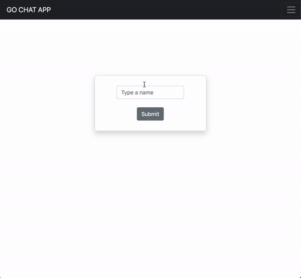

# Go Chat App

## Packages Used

- net/http
- html/template
- gorilla/mux
- gorilla/session
- gorilla/websockets

## To-Do

- ~~Implement WebSockets to update connected clients when someone sends a message~~
- ~~HTML Template msg on client~~
- Improve the authentification service by making use of cookies too
- Implement goroutines support
- Refactor the App
    - Get rid of Global variables and implement types
- Test the App